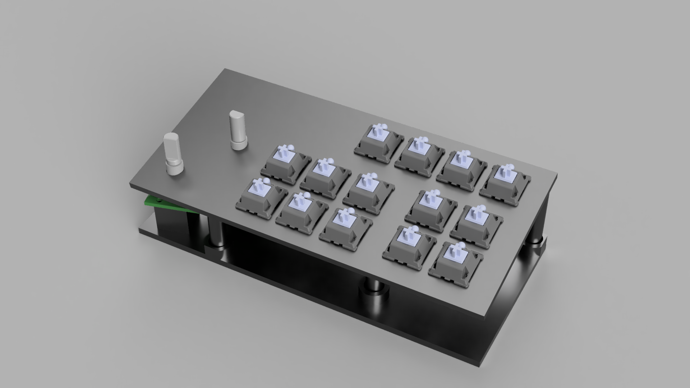
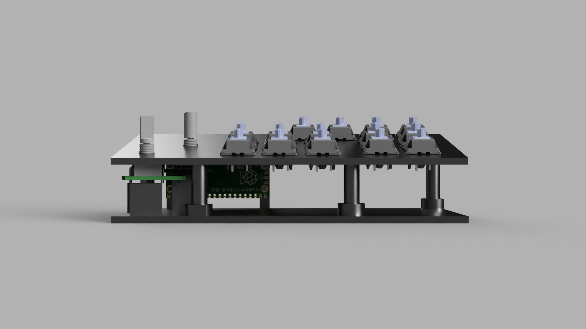

# Macros Hot-keys

### Parts List

| Part | No.s | Note |
| ---- | ---- | ---- |
| Key Switches | 12 | (Upto You, I've used a mix of Kailh Blue's and Otemu Brown's) | 
| Key Caps | 12 | (Upto You) |
| Rotary Encode with Switch | 2 | |
| Raspberry Pi Pico | 1 |
| 1N4148 Fast switching diode through hole | 12 | | 
| 0.1mm copper jumper wire | 1m | |

And a 3D printer 😂.

## Instructions to Print

```Path: ./3D_Model/To_Print/ ```

| File Name | In-Fill | Color | Filament |
| --------- | ------- | ----- | -------- |
| [Main_Base_Plate](3D_Model/To_Print/main_base_plate.stl) | 30% | Black | PLA |
| [Main_Top_Plate](3D_Model/To_Print/main_top_plate.stl) | 30% | Black | PLA |

## Images of the Model

**Home View**


**Front View**


## Circuit

